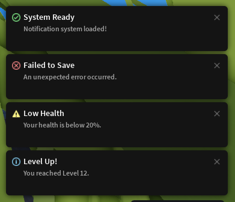

# IvNotify: Universal Notification System

IvNotify is a simple light-weight system for showing clean, styled pop up notifications like errors, 
warnings, info, and success messages. It gives you a few functions to trigger these notifications with a title, message, and optional duration.

<p align='center'>
  
</p>

## Setup
```lua
if not getgenv().IvNotify then
    loadstring(game:HttpGet('https://raw.githubusercontent.com/BloodyBurns/Lua/refs/heads/main/Universal%20Notification%20System/init.lua'))()
end

IvNotify.info('Universal Notification System', 'Hello World!')
````

## Methods
Each method displays a notification styled with the matching icon and color.

`IvNotify` has methods for each notification type, where `<type>` is one of:

`error`, `info`, `warning`, `success`

```lua
IvNotify.<type>(title: string, message: string, duration?: number)
```

## Parameters

| Name       | Type      | Description                                                              |
| ---------- | --------- | ------------------------------------------------------------------------ |
| `title`    | `string`  | The header text shown in the notification.                               |
| `message`  | `string`  | The body/content of the notification.                                    |
| `duration` | `number?` | *(Optional)* Time in seconds before the notification fades. Default: `5` |

---

## Example Usage

```ts
IvNotify.success('System Ready', 'Notification system loaded!')

IvNotify.error('Failed to Save', 'An unexpected error occurred.', 6)

IvNotify.warning('Low Health', 'Your health is below 20%.')

IvNotify.info('Level Up!', 'You reached Level 12.', 4)
```
